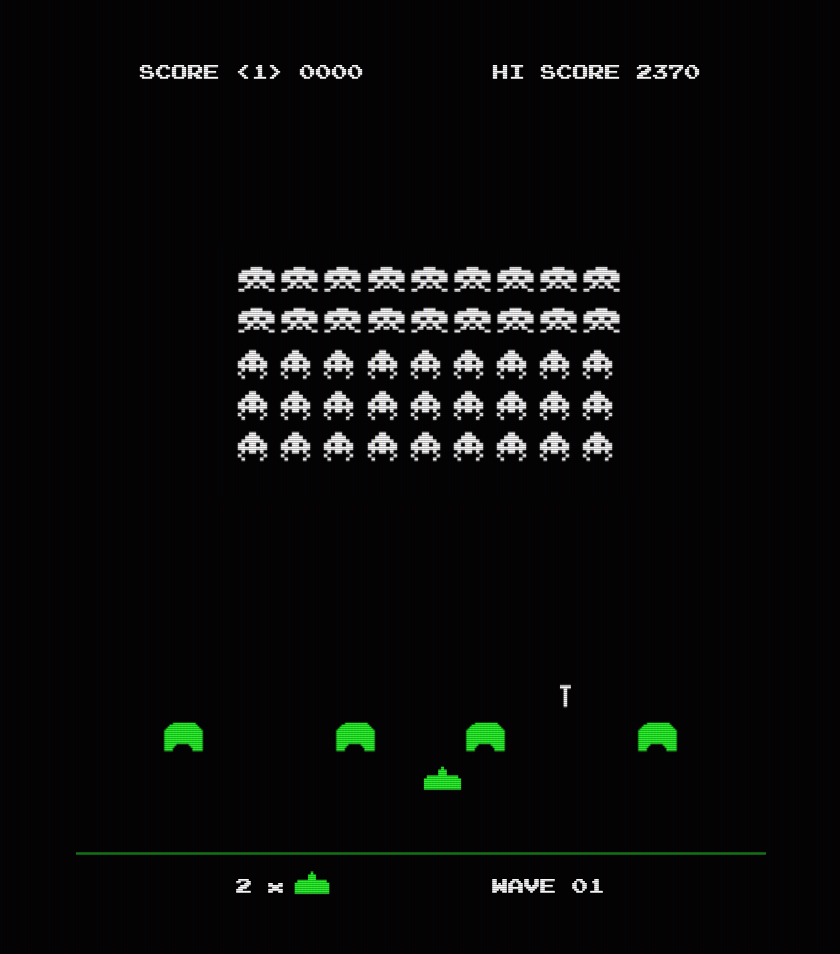

# Space Invaders




## Project Overview

Space Invaders is a classic arcade game from the 80s. The player aims to shoot an invading alien armada, before it reaches the planet's surface, using a mounted gun turret.

This was my first project for General Assembly’s Software Engineering Course. It was a solo project, took 8 days, and was my first real project using JavaScript. 

The app is deployed using GitHub Pages and is available [here](https://majoggy.github.io/sei-project-1/).

## Brief 

To implement a functioning grid based game in the browser using HTML, CSS and JavaScript.
The player should be able to clear at least one wave of aliens.
The player's score should be displayed at the end of the game.

## Technologies Used

* HTML5
* CSS3
* JavaScript
* Git
* GitHub
* Google Fonts

## Process

I started planning by listing the core gameplay mechanics needed to provide the most basic possible version of the game, the most essential elements, then adding optional elements on top.

The game is grid-based - essentially a div looped to create a 16x16 grid, pushed to an array and then appended to screen.

My first big challenge was to create the invaders and make them move similarly to the arcade game - across the screen and then down a row when they reach the grid edge, changing direction in the process. Their creation was relatively simple - create an array with their starting positions corresponding to the index numbers of the grid.

The movement, however, was trickier. I created a movingInvaders function which was set to a timer. My first iterations moved across the screen fine, but with no collision detection in place simply wrapped around the screen, iterating through the grid numbers one by one. I was stuck on this for quite some time, with the invaders always doing something unanticipated on reaching the edge of the grid.

```javascript function movingInvaders() {
  const gridLeft = invaderArray[0] % gridWidth === 0
  const gridRight = invaderArray[invaderArray.length - 1] % gridWidth === gridWidth - 1

  removeInvaders()
  
  if (gridRight && invaderDirection === 1) {
    invaderArray = invaderArray.map(invader => invader + gridWidth + 1)
    invaderAltArray = invaderAltArray.map(invader => invader + gridWidth + 1)
    invaderDirection = -1
  } else if (gridLeft && invaderDirection === - 1) {
    invaderArray = invaderArray.map(invader => invader + gridWidth - 1)
    invaderAltArray = invaderAltArray.map(invader => invader + gridWidth - 1)
    invaderDirection = 1
  } 
  invaderArray = invaderArray.map(invader => invader + invaderDirection)
  invaderAltArray = invaderAltArray.map(invader => invader + invaderDirection)
  
  addInvaders()

  if (deadInvaderArray.length === 45) {
    hasWon()
  }
}
```


I solved this by creating an invaderDirection variable that swaps between -1 and 1 every time it reaches the grid edge. This had the effect of swapping their direction of travel from right to left, adding 16 (the width of the grid) to every invader, so they also moved down a row. Every time the timer fired the invaders would be removed, their position recalculated and then redrawn again in their new positions. 

Next, I created a variable to hold the position of the player on the grid, and mapped the movement to my handleKeyUp function. 

Now that I had my protagonists, my next challenge was to get them to shoot at each other. Making the player shoot the invaders was relatively straightforward - when the player presses the spacebar, a laser class is tracked across the grid, set to an interval of 25 milliseconds for smooth travel. The projectile checks at every point for collisions with the invaders, and will eventually stop upon reaching the top of the screen.

```javascript function playerShoot() {
  keySpam = true
  let position = playerPosition - gridWidth
  setTimeout(keySpamTimer,900)
  if (cells[position].classList.contains(barrierClass)) {
    return
  }
  cells[position].classList.add(playerPClass)
  shootAudio()
  const projectileSpeed = setInterval(shootProjectile,25)
  
  function shootProjectile() {
    cells[position].classList.remove(playerPClass)
    if (position <= gridWidth || endWave || isGameOver) {
      clearInterval(projectileSpeed)  
      return
    }
    position -= gridWidth
    cells[position].classList.add(playerPClass)
    playerHit()
  }
  ```


Implementing the invaders firing at the player was somewhat trickier, and after a few false starts I decided on a function which randomly picks a position in the invader array and fires from it, set to repeat every 1500 milliseconds. This worked well enough, but on testing I realised it also fired from the invaders the player had already killed.

This was as a result of the way I had dealt with invader death. Invaders are never removed from the invader array, because as you remove numbers from the array the whole fleet starts to lose its shape. To deal with this, I simply replaced the class at that index position with a dead invader class, and then added the index to a dead invader array. Therefore, I could work out which invaders had been hit by checking one against the other. I eventually settled on the function below, which I was quite proud of!

```javascript function calculatePossibleShooters () {
  possibleshooterArray = []
  for (let i = 0; i < invaderArray.length; i ++) {
    if (!deadInvaderArray.includes(i)) possibleshooterArray.push(i)
  }
  const randomShooterGenerator = possibleshooterArray[Math.floor(Math.random() * possibleshooterArray.length)]
  return parseInt(cells[invaderArray[randomShooterGenerator]].value)
}
```


Once the bones of the project were solid, I started styling. My choice to replicate the original arcade game as much as I could meant that styling was quick and effective - I could constantly refer to the original for my styling decisions.

## Challenges

As this was really my first project utilising JavaScript, there were numerous challenges and stumbling blocks across the way. Getting the invaders to move correctly became a bit of a time sink at the beginning of the project, but after a lot of trial and error I managed to deal with it.

I also had a real issue with the end game - where there are only a few invaders from the back rows left. During play testing I frequently got into a situation where the ‘dead’, essentially invisible aliens in the invader array actually get to the very bottom of the grid, forcing the game to end. I ‘solved’ this by moving these invaders to the beginning of the grid - as they’re invisible at this point, the player doesn’t notice. The solution I came up with only seemed to solve the problem half the time and I didn’t have the time to improve it.

 ``` javascript // Code for dealing with array falling off screen
  for (let i = 0; i < invaderArray.length; i ++) {
    if (invaderArray[i] >= cells.length) {
      invaderArray[i] = screenTopArray[screenTopCount]
      screenTopCount += 1
    }

```


## Wins

I was able to implement many of my stretch goals - including adding player scores to local storage, adding additional waves, having different invader varieties, as well as gradually speeding up the gameplay so the game gets progressively harder.

## Future Content and Improvements

I achieved a lot of what I set out to do in this project, however, there were a few things I would like to implement or change going forward:

True responsive design. I have used media queries to politely ask those on phones to use a desktop computer or tablet, which is only marginally better than not addressing it at all!
Adding the bonus mothership from the arcade game.

## Key Learnings

I had a non-insignificant amount of refactoring to do towards the end of the project, and I would have been better served had I prioritised doing this as I went - I think it would have simplified some of the logic and made things clearer for me as I tried to add additional features.
